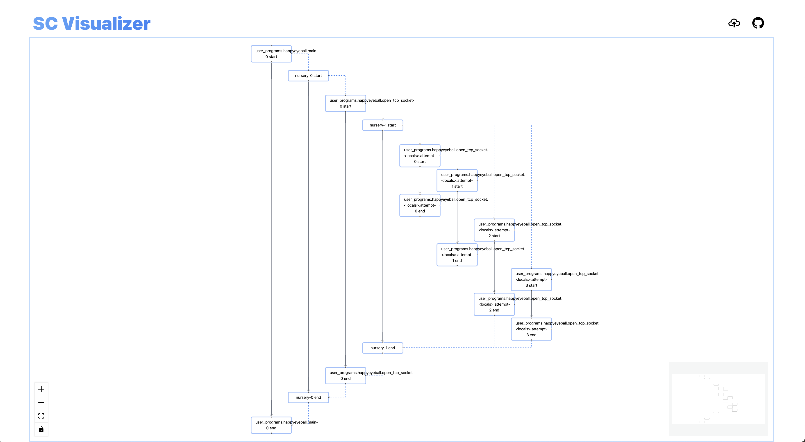

# sc-vis

Structured Concurrency Visualization.

The purpose of this project is to visualize the relations of scopes in Struecture Concurrency.
For now, it accept the output from [trio-sc-vis].

However, the visulizer interface should be language-agnostic (at least the format of the input is correct).

## How to

[sc-vis]: https://sc-vis.ianchen-tw.github.io
[trio-sc-vis]: https://github.com/ianchen-tw/trio-monitor

1. Visit [sc-vis]
2. Click the upload button on the right menu bar.
3. Upload your log output (`logs.json`) from [trio-sc-vis]
4. See your result in the browser panel.

## Try

Upload `examples/happyeyeball.json` to see example output.