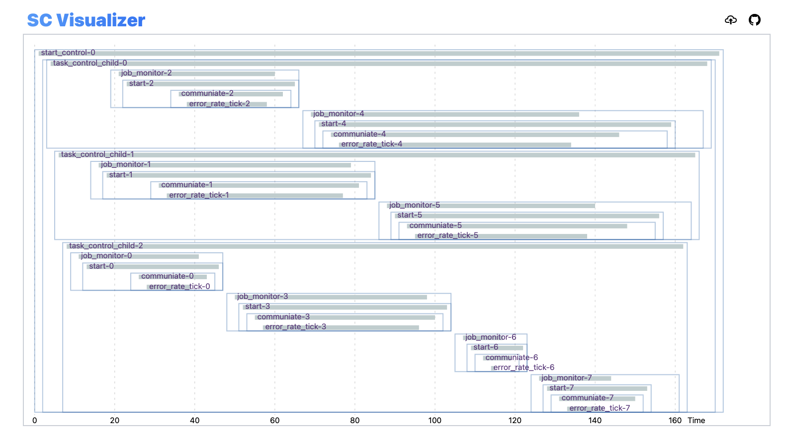

# sc-vis

Structured Concurrency Visualization.

The purpose of this project is to visualize the relations of scopes in Struecture Concurrency.
For now, it accept the output from [trio-vis].

However, the visulizer interfould be language-agnostic (at least the format of the input is correct).

## How to

[sc-vis]: https://ianchen-tw.github.io/sc-vis
[trio-vis]: https://github.com/ianchen-tw/trio-vis

1. Visit [sc-vis]
2. Click the upload button on the right menu bar.
3. Upload your log output (`logs.json`) generated from [trio-vis]
4. See your result in the browser panel.

## Try

Upload `examples/sc-logs-err-control.json` to see example output.